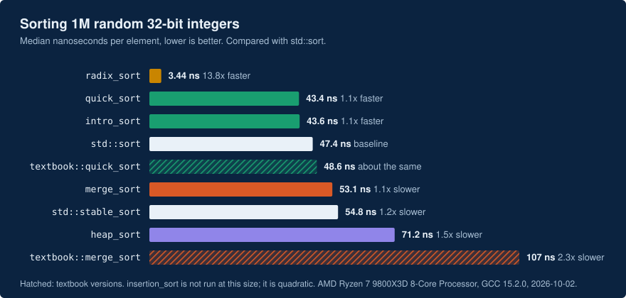
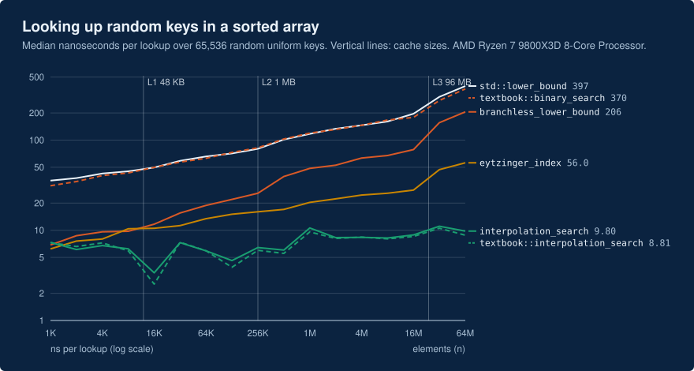
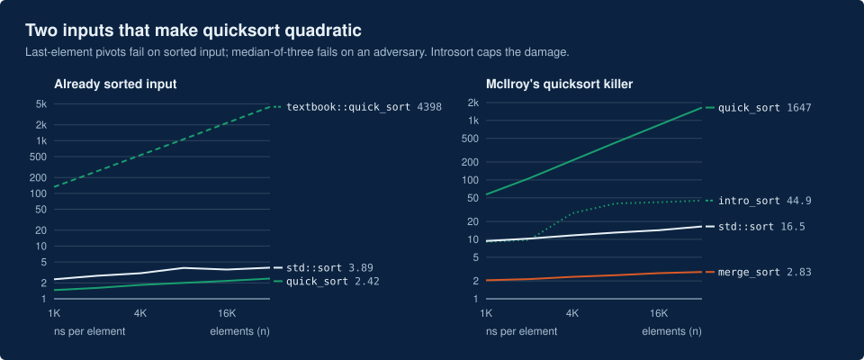
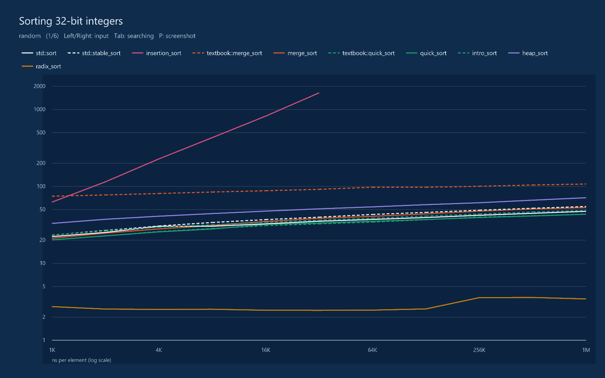

# Algorithmic Analysis and Optimization

Sorting and searching, from the textbook version to the fast one, with every step measured.

[](https://github.com/mbn-code/Algorithmic-Analysis-and-Optimization/actions/workflows/ci.yml)



**[Open the interactive visualizer](https://mbn-code.github.io/Algorithmic-Analysis-and-Optimization/)**: race eight
sorting algorithms, step through each one next to its C++ source, watch where a search looks in memory, and explore
the benchmark results.

This repository contains:

- **A header-only C++20 library** ([`include/aao`](include/aao)) with each algorithm in two versions: the one from
  the textbook, and what it becomes after measurement-driven optimization. Eight sorts and five searches, all
  generic over iterators and comparators.
- **A benchmark** ([`bench`](bench)) that checks every result against the standard library, counts comparisons, and
  measures six input shapes from 1,000 to 64 million elements. It writes CSV, and optionally a trace you can open in
  Perfetto.
- **An analysis** ([`docs/analysis.md`](docs/analysis.md)) that puts the textbook math next to the measurements. The
  comparison counts match the formulas, most to within 0.1%; the running times are a different story.
- **The visualizer** ([`web`](web)) and a native results viewer built on raylib ([`viewer`](viewer)).

## What optimization bought

Measured on an AMD Ryzen 7 9800X3D with GCC 15.2 at `-O3`, 32-bit integer keys. Your numbers will differ; the
[benchmark](#run-it) takes three minutes.

| Change                                                                                        | Input                                         |           Before |          After |
| --------------------------------------------------------------------------------------------- | --------------------------------------------- | ---------------: | -------------: |
| Merge sort: one buffer instead of two allocations per merge, insertion sort below 32 elements | 1M random                                     |   107 ns/element |  53 ns/element |
| Merge sort: skip merging two runs that are already in order                                   | 1M sorted                                     |    54 ns/element | 0.9 ns/element |
| Quicksort: median-of-three pivot instead of the last element                                  | 32K sorted                                    | 4,398 ns/element | 2.4 ns/element |
| Introsort: fall back to heap sort when recursion gets too deep                                | 32K [quicksort killer](#the-quicksort-killer) | 1,647 ns/element |  45 ns/element |
| Radix sort instead of `std::sort`: no comparisons at all                                      | 1M random                                     |    47 ns/element | 3.4 ns/element |
| Branchless binary search instead of `std::lower_bound`                                        | 1M keys                                       |    117 ns/lookup |   49 ns/lookup |
| Eytzinger layout instead of a sorted array                                                    | 64M keys (256 MB)                             |    397 ns/lookup |   56 ns/lookup |



Searching is a story about memory more than comparisons. Every search below makes about the same number of probes;
the curves bend where the array outgrows each cache level.



### The quicksort killer

Every deterministic quicksort has inputs that make it quadratic. Last-element pivots fail on sorted input. Median of
three survives that, but not [McIlroy's adversary](https://www.cs.dartmouth.edu/~doug/mdmspe.pdf), which decides the
input's values during the sort so that every pivot lands near an extreme. The benchmark builds that input for
`aao::quick_sort`; introsort, the strategy behind `std::sort`, caps the damage.



## What the measurements taught

**Fewest comparisons is not fastest.** The textbook merge sort makes 19.6 million comparisons on 1M random keys,
within 1% of the theoretical minimum for any comparison sort. It is also the slowest comparison sort measured. The
tuned version makes 26% more comparisons and takes half the time: allocation, branch mispredictions and cache misses
cost more than comparisons do.

**The branch predictor learns your benchmark.** Sorting the same 1,000-element array thousands of times lets the CPU
memorize its comparison outcomes. `std::sort` measured 2.3 ns per element that way, and 22.7 on fresh arrays. The
benchmark now rotates through 16 inputs at small sizes.

**Radix sort has a cache trap.** On the keys 0 to 2²⁰−1, already sorted, it is four times slower than on random keys.
Every bucket is exactly the same size, so 256 write positions advance in lockstep exactly 16 KB apart and collide in
the same cache sets. Sorted keys with random gaps run at full speed.

**Interpolation search is a gamble.** On uniformly distributed keys it needs O(log log n) probes: 9 ns per lookup at
64M keys, against 397 for `std::lower_bound`. On skewed keys the textbook version degrades to O(n): 23 µs per lookup
at only 64K keys. The guarded version alternates guesses with halving steps, which bounds the damage.

**Version 1 of this project measured the wrong things.** It reported quicksort as 7x slower than merge sort, because
its quicksort created a new `std::random_device` and `std::mt19937` on every partition call: creating them once makes
the same code 35x faster (629 to 18 µs for 1,000 elements). Its binary search benchmark timed `std::cout`. Its
interpolation search overflowed on wide key ranges and divided by zero on runs of equal keys; the tests in
[`tests/tests.cpp`](tests/tests.cpp) cover both.

## Run it

Requirements: CMake 3.20+ and a C++20 compiler. CI builds and tests with GCC and Clang on Linux, Apple Clang on macOS,
and MSVC on Windows.

```sh
git clone https://github.com/mbn-code/Algorithmic-Analysis-and-Optimization
cd Algorithmic-Analysis-and-Optimization
cmake -B build -DCMAKE_BUILD_TYPE=Release
cmake --build build --config Release
ctest --test-dir build -C Release
./build/aao_bench --out my-results
```

With Visual Studio the binaries land in `build/Release/`.

| `aao_bench` option | Effect                                                                           |
| ------------------ | -------------------------------------------------------------------------------- |
| `sort`, `search`   | Run one suite instead of both                                                    |
| `--quick`          | Small sizes and short measurements, about 10 seconds                             |
| `--out DIR`        | Where to write `sort.csv`, `search.csv` and `meta.json` (default `results`)      |
| `--max-n N`        | Largest input size                                                               |
| `--filter TEXT`    | Only algorithms whose name contains `TEXT`                                       |
| `--trace FILE`     | Also write a Chrome trace; open it in [ui.perfetto.dev](https://ui.perfetto.dev) |

To browse results in a native window, build the viewer (CMake downloads raylib 5.5):

```sh
cmake -B build -DAAO_BUILD_VIEWER=ON
cmake --build build --config Release
./build/aao_viewer my-results
```



To run the visualizer locally, serve the repository root with any static server, for example
`python -m http.server`, and open `http://localhost:8000/web/`.

## Use the library

Copy `include/aao` into your project, or pull it in with CMake:

```cmake
include(FetchContent)
FetchContent_Declare(aao GIT_REPOSITORY https://github.com/mbn-code/Algorithmic-Analysis-and-Optimization GIT_TAG main)
FetchContent_MakeAvailable(aao)
target_link_libraries(your_target PRIVATE aao::aao)
```

```cpp
#include <aao/search.hpp>
#include <aao/sort.hpp>

std::vector<int> v = load_numbers();

aao::intro_sort(v.begin(), v.end());                      // any random-access range
aao::merge_sort(v.begin(), v.end(), std::greater<>{});    // any comparator, stable
aao::radix_sort(v.begin(), v.end());                      // integer keys only

auto it = aao::branchless_lower_bound(v.begin(), v.end(), 42);

aao::eytzinger_index<int> index(v.begin(), v.end());      // build once, O(n)
const int* hit = index.lower_bound(42);                    // nullptr if every key is < 42
```

| Function                         | Best    | Average                  | Worst   | Extra space            | Stable |
| -------------------------------- | ------- | ------------------------ | ------- | ---------------------- | ------ |
| `insertion_sort`                 | n       | n²                       | n²      | 1                      | yes    |
| `textbook::merge_sort`           | n log n | n log n                  | n log n | n, allocated per merge | yes    |
| `merge_sort`                     | n       | n log n                  | n log n | n/2, allocated once    | yes    |
| `textbook::quick_sort`           | n log n | n log n                  | n²      | n (recursion)          | no     |
| `quick_sort`                     | n log n | n log n                  | n²      | log n                  | no     |
| `intro_sort`                     | n log n | n log n                  | n log n | log n                  | no     |
| `heap_sort`                      | n log n | n log n                  | n log n | 1                      | no     |
| `radix_sort`                     | n·w     | n·w                      | n·w     | n                      | yes    |
| `textbook::binary_search`        | 1       | log n                    | log n   | 1                      |        |
| `branchless_lower_bound`         | log n   | log n                    | log n   | 1                      |        |
| `textbook::interpolation_search` | 1       | log log n (uniform keys) | n       | 1                      |        |
| `interpolation_search`           | 1       | log log n (uniform keys) | log n   | 1                      |        |
| `eytzinger_index::lower_bound`   | log n   | log n                    | log n   | n (the index)          |        |

Search functions return the first element not less than the key, like `std::lower_bound`, except
`textbook::binary_search`, which returns any matching element or `last`.

## How the benchmark measures

- Inputs are generated deterministically with SplitMix64, so every compiler and platform sorts the same arrays.
- Each measurement runs once as a warm-up, then repeats until it has used 0.2 s and at least 5 repetitions. The
  reported number is the median.
- Small sorting inputs rotate through 16 different arrays, so the branch predictor cannot memorize one.
- Every sort's output is compared against `std::sort`, and every search's results are checksummed; a wrong answer
  stops the run.
- Comparisons are counted in a separate, untimed run with a counting comparator.
- Searches measure the throughput of 65,536 independent lookups of keys that exist in the array.
- Quadratic algorithms stop at 32K elements, and the quicksort killer is generated up to 32K (building it costs a
  quadratic sort).

The committed [`results`](results) come from one desktop machine with frequency boost enabled; treat small
differences as noise. Results from other processors are welcome as pull requests.

## Repository layout

```
include/aao/   the library: sort.hpp, search.hpp
bench/         benchmark runner, input generators, trace writer
tests/         C++ tests (ctest) and tests for the JavaScript ports (node --test)
results/       the reference run: sort.csv, search.csv, meta.json
web/           the interactive visualizer, deployed to GitHub Pages
viewer/        native results viewer (raylib)
tools/         regenerate the README charts and animation from results/
docs/          analysis.md, chart assets, and the original 2024 study project
```

## Background

This began in 2024 as a study project (SOP) in Mathematics A and Programming B at a Danish HTX upper-secondary
school, asking how mathematical analysis of algorithms relates to their real performance. The original report, Maple
derivations and diagrams are in [`docs/sop`](docs/sop). Version 2 rebuilds the code around that question: every
algorithm has a tested textbook and optimized form, the benchmark avoids the measurement mistakes of version 1, and the
analysis is checked against the data.

## Contributing

Issues and pull requests are welcome; see [CONTRIBUTING.md](CONTRIBUTING.md). Benchmark results from other machines
are especially useful.

## License

[MIT](LICENSE)
